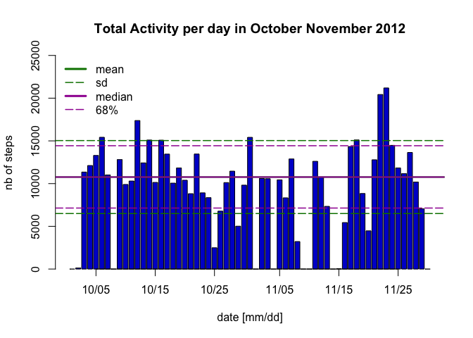
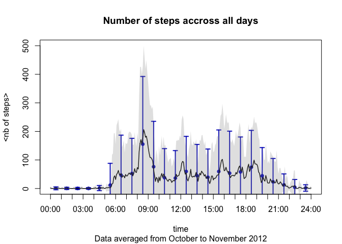
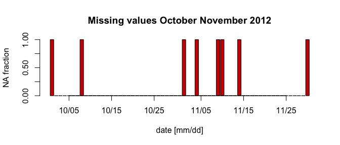
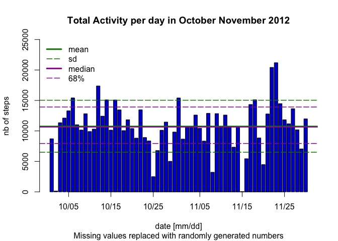
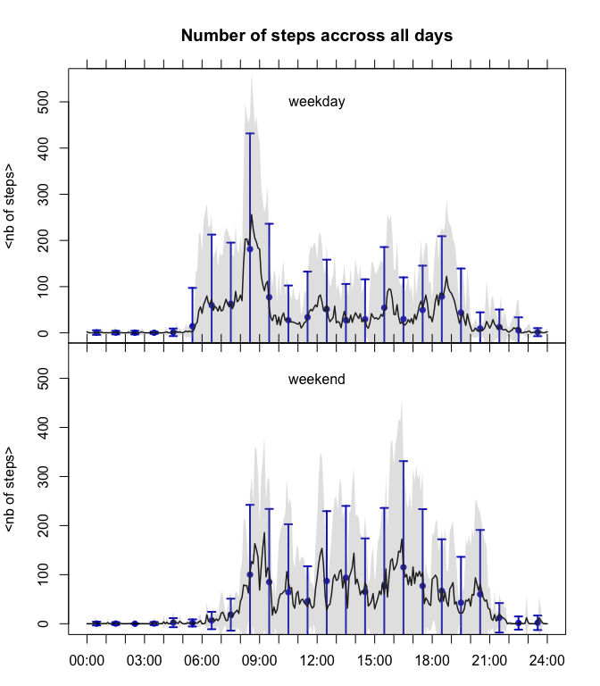

# Reproducible Research: Activity Monitoring
Dylan Tweed  
June 3, 2016  


# Introduction

It is now possible to collect a large amount of data about personal movement
using activity monitoring devices such as a [Fitbit](http://www.fitbit.com/), [Nike Fuelband](http://www.nike.com/us/en_us/c/nikeplus-fuelband), or [Jawbone
Up](https://jawbone.com/up). These type of devices are part of the “quantified self” movement – a group
of enthusiasts who take measurements about themselves regularly to improve
their health, to find patterns in their behavior, or because they are tech geeks.
But these data remain under-utilized both because the raw data are hard to
obtain and there is a lack of statistical methods and software for processing and
interpreting the data.
This assignment makes use of data from a personal activity monitoring device.
This device collects data at 5 minute intervals through out the day. The data
consists of two months of data from an anonymous individual collected during
the months of October and November, 2012 and include the number of steps
taken in 5 minute intervals each day.

# Loading and Preprocessing

We quickly describe the data, and detail additional preprocessing that is relevant for this analysis. 

## Original data

The original tidy data set was downloaded from [Activity Minotoring data (zip archive 52K)](https://d396qusza40orc.cloudfront.net/repdata%2Fdata%2Factivity.zip)


```r
file_Activity <- "activity.csv"
Activ <- read.csv(file_Activity)
str(Activ)
```

```
## 'data.frame':	17568 obs. of  3 variables:
##  $ steps   : int  NA NA NA NA NA NA NA NA NA NA ...
##  $ date    : Factor w/ 61 levels "2012-10-01","2012-10-02",..: 1 1 1 1 1 1 1 1 1 1 ...
##  $ interval: int  0 5 10 15 20 25 30 35 40 45 ...
```

The variables included in this data set are:

* `$steps`: Number of steps taking in a 5-minute interval (missing values are
coded as NA)
* `$date`: The date on which the measurement was taken in YYYY-MM-DD
format, standard ISO 8601:2004
* `$interval`: Identifier for the 5-minute interval in which measurement was taken. The problem is that it is written in %h%m format as integer (e.g. the 0 are not printed) [1][Note in the instructions, this issue was neglected as one can notice from figure 1. Since we correct this column, we obtain the correct time stamp.]

## Preprocessing

The data contains numerous `NA` values, and dates are written as characters.
The the preprocessing we apply first is:  

1. Correct the interval entry, convert into character with 0.
1. Add a new `time` entry, conversion of `interval` into a `POSIXct` object. (We could have combined it with the `date` entry.  
1. Converting entry `$date` into `Date` object.
1. Add a new `factor` entry `$wday` with the corresponding week day.
1. Add a new `charactor` entry `$md` with the corresponding day written as "mm/dd"


```r
library(lubridate,quietly=TRUE,warn.conflicts = FALSE)
## Edit the entries
## First convert the date comlumn into date object
## Note: this entry is in the default ISO 8601 format (%Y-%m-%d")
## so no need to specify one
Activ$date <- as.Date(Activ$date)
## Convert interval form integers to character (with 0 fill)
Activ$interval <- formatC(Activ$interval,format="d",width=4,flag="0")
## Add ':' in the middle so that it is usable for lubridate
Activ$interval <- paste(
    substring(Activ$interval,1,2),
    substring(Activ$interval,3,4),
    sep=":"
)
## Convert interval into time column, not really necessary
Activ$time <- hm(Activ$interval)
## Add weekday factor
Activ$wday <- as.factor(weekdays(Activ$date))
## Add formated date without year
Activ$md   <- as.character(Activ$date,"%m/%d")
## Quick check
str(Activ)
```

```
## 'data.frame':	17568 obs. of  6 variables:
##  $ steps   : int  NA NA NA NA NA NA NA NA NA NA ...
##  $ date    : Date, format: "2012-10-01" "2012-10-01" ...
##  $ interval: chr  "00:00" "00:05" "00:10" "00:15" ...
##  $ time    :Formal class 'Period' [package "lubridate"] with 6 slots
##   .. ..@ .Data : num  0 0 0 0 0 0 0 0 0 0 ...
##   .. ..@ year  : num  0 0 0 0 0 0 0 0 0 0 ...
##   .. ..@ month : num  0 0 0 0 0 0 0 0 0 0 ...
##   .. ..@ day   : num  0 0 0 0 0 0 0 0 0 0 ...
##   .. ..@ hour  : num  0 0 0 0 0 0 0 0 0 0 ...
##   .. ..@ minute: num  0 5 10 15 20 25 30 35 40 45 ...
##  $ wday    : Factor w/ 7 levels "Friday","Monday",..: 2 2 2 2 2 2 2 2 2 2 ...
##  $ md      : chr  "10/01" "10/01" "10/01" "10/01" ...
```


# Total number of steps taken each day

In this section, we ignore the fact that the data contains missing values.

## Basic statistical calculations

We disrespect the order of the assignment because we wish to plot these values in the histogram.


```r
## Counting the total number of steps per day after removing NAs.
noNA       <- !is.na(Activ$steps)
dayActnoNA <- tapply(Activ$steps[noNA],as.factor(Activ$md[noNA]),sum)
## Mean and standard deviation
meantot    <- mean(dayActnoNA)
sdtot      <- sd(dayActnoNA)
## Median and 68%
tot68      <- quantile(dayActnoNA,probs=c(0.16,0.5,0.84))
```

We apply a selection on `Activ$steps` to remove missing values prior to compute the total number of steps for each day. The alternative would be to use option `na.rm=TRUE` in `sum` to ignore them. but dates with no values would become 0. In that case the mean and median would be affected. 

## Histogram

In order to compute the data require for the histogram, we don't make any preselection before applying `sum` with `na.rm=TRUE`. 


```r
## Counting the total number of steps per day
## dates with only NA will give 0
dayAct <- tapply(Activ$steps,as.factor(Activ$md),sum,na.rm=TRUE)
## Plotting the histogram
mybar <- barplot(dayAct,xaxt="n",
                 main = "Total Activity per day in October November 2012",
                 ylim = c(0,2.5e4),
                 xlab = "date [mm/dd]",
                 ylab = "nb of steps",
                 col = "#0000d0"
)
## set colors here
colmean <- "#008000"
colmed  <- "#a000a0"
## draw mean and standart deviation as horizontal lines
abline(h=meantot,lwd=2,col=colmean)
abline(h=meantot-sdtot,lwd=1.5, lty = "longdash",col=colmean)
abline(h=meantot+sdtot,lwd=1.5, lty = "longdash",col=colmean)
## draw mean and standart deviation as horizontal lines
abline(h=tot68[2],lwd=2,col=colmed)
abline(h=tot68[1],lwd=1.5, lty = "longdash",col=colmed)
abline(h=tot68[3],lwd=1.5, lty = "longdash",col=colmed)
## a legend
legend("topleft",
       bty="n",
       legend=c("mean","sd","median","68%"),
       lty=c(1,5,1,5),
       lwd=c(3,1.5,3,1.5),
       col=c(colmean,colmean,colmed,colmed)
)
## draw and label the axis the way I want, (the barplot was saved as mybar to obtain a matching axis)
axis(1,at=mybar[grep("5$",row.names(dayAct))],labels=grep("5$",row.names(dayAct),value=TRUE))
```



This histogram represents the total number of steps per day. The horizontal solid lines show the mean and median respectively in green and purple. As both lines overlap, only the median is apparent.The  $1-\sigma$ confidence regions are displayed as long-dashed lines, in green for the standard deviation to the mean and purple for the 68% confidence region.
This sum may be irrelevant if days contains different fractions of missing values, which would artificially decrease the total for the specific day. We address this question in a later section.

## Statistical estimates

Across all days; 

* we obtain a mean ($\pm$ standard deviation) of 10766.19 $\pm$ 4269.18 (as displayed in green in the histogram).
* we obtain of median of 10765 with the 68% confidence region within [7139.48, 14433.52] (as displayed in purple in the histogram).

# Evolution of the number of steps during the day

After looking at the distribution of the total number of step across the test period. We combine the data to infer the activity pattern across the day. Once again we neglect the impact of the missing values.

## Mean evolution

The figure we generate requires to compute the mean across all days of the test period as a function of the `interval`. Additional we compute the standard deviation to obtain some error bar. As the data is quite noisy, we also compute the same statistics, average by the hour. 

### Computing statistics per time interval


```r
## Statistics by interval
## Create a data frame with mean and standard deviation
stepbyt <- data.frame(
    mean = tapply(Activ$step,Activ$interval,mean,na.rm=TRUE),
    sd   = tapply(Activ$step,Activ$interval,sd,na.rm=TRUE)
)
## Create column with the shaded region
stepbyt$upsh  <- stepbyt$mean+stepbyt$sd
stepbyt$lowsh <- stepbyt$mean-stepbyt$sd
## Repeat the first row at the end
stepbyt       <- rbind(stepbyt,"24:00"=stepbyt[1,])
## Create abscisse for plotting
stepbyt$tday  <- 1:nrow(stepbyt)
```

### Computing statistics per hour


```r
## Statistics by hour.
## factor variable correspondinf to hours instead of 5 mn intervals
fhour   <- as.factor(substring(as.character.POSIXt(Activ$interval),1,2)) 
## Create a data frame with mean and standard deviation
stepbyh <- data.frame(
    mean = tapply(Activ$step,fhour,mean,na.rm=TRUE),
    sd   = tapply(Activ$step,fhour,sd,na.rm=TRUE)
)
## Create abscisse for plotting
stepbyh$tday <- grep("30$",row.names(stepbyt))
```

This figure shows the evolution of the number of step during the day. The mean is displayed as the solid line, the shaded region correspond to the 1-$\sigma$ confidence region calculated from the standard deviation to the mean. 

## Average activity pattern during the day


```r
## Load plotting library 
library(Hmisc,warn.conflicts=FALSE,quietly=TRUE)
## Plot point with error bar for hourly statistics 
with(stepbyh,
     errbar(tday,mean,mean+sd,mean-sd,
            xaxt="n",
            xlab= "time",
            ylab= "<nb of steps>",
            xlim=c(1,nrow(stepbyt)),
            ylim=c(0.,500.),
            col="#0000c0f0",
            errbar.col="#0000c0f0",
            lwd=2
     )
)
## Add line for the mean per interval
with(stepbyt,lines(tday,mean,lwd=1.5))
## Add saded region of the standard deviation per interval
with(stepbyt,
     polygon(c(tday, rev(tday)), c(upsh, rev(lowsh)),
             col = "#90909040", border = NA)
)
## label the axis
axis(1,
     at=grep(":00",row.names(stepbyt)),
     label=grep(":00",row.names(stepbyt),value=TRUE)
)
## add titles
title(main= "Number of steps accross all days",
    sub = "Data averaged from October to November 2012"
)
```



The most striking feature of this figure is actually the difference between day time and night. The activity pattern is null before 6am, and very low after 10 pm. This result is obvious, but should be pointed out as a sensible test of the data. 

## Actvity peak

We can point out that the standard deviation is always greater that the mean, so given the noisiness of the data it may be premature to draw conclusions. 


Still the mean show a clear maximum at 08:35 ranging from 08:10 to 09:20 (half maxima).

This data could suggests that the subject is running between 8 am and 9 am.

Supposing the subject actually runs ever day in this time period, the values we obtain are too low. The running stride being of the order of 150 steps per min and walking stride of 75 steps per minute, our corresponding values should be close to 750 steps and 375 steps respectively.  
If the error bar were small, translating a strict daily routine, we could suppose that the actual data are the average steps per minutes taken over 5 min interval and not the total number of steps. Since the error bars are large, it is more logical to suppose the the values are low due to variations in the activity pattern.

The error bars suggest large variation in the routine, with period of activity being shorter the the width of the peak, not occurring within the sames intervals and not occurring every day.
We could model this hypothesis, by convolution of a normal distribution of mean 08:35 and half width half maxima of 35 minutes to a top hat model of height $\sim$ 750 and widths ranging form 15 to 30 min.
We could also suppose that the subject is not running every day, this would also have a significant effect on the peak and explain the error bar. It may be relevant to check whether this peak occurs in both weekends and weekday before applying any kind of modeling.

# Compensating for missing values

Up until now, we neglected the issue of missing values. But they can strongly affect the previous results:

* For the distribution of the total number of steps per day.
    * If some days contains only missing values, the mean and median won't be affected
    * If some days contain both missing and non missing values, the total is underestimated and the mean and median also underestimated.
* For the activity pattern
    * The results are not affected any specific direction, except that the lack of data renders the statistic less reliable, with larger error.  

## Issue of missing values

The issue is that we display sum for a data set with a non negligible fraction of missing values. 


Within this data frame we have 17568 measurements among which, 2304 missing values.
Meaning that:


```r
## Counting the total number of steps per day
## dates with only NA will give 0
NAAct <- tapply(is.na(Activ$steps),as.factor(Activ$md),sum)/tapply(Activ$steps,as.factor(Activ$md),length)
## Plotting the histogram
mybar <- barplot(NAAct,xaxt="n",yaxt="n",
                 main = "Missing values October November 2012",
                 xlab = "date [mm/dd]",
                 ylab = "NA fraction",
                 ylim = c(0,1),
                 col = "#d00000"
                 )
## draw and label the axis the way I want, (the barplot was saved as mybar to obtain a matching axis)
axis(1,at=mybar[grep("5$",row.names(NAAct))],labels=grep("5$",row.names(NAAct),value=TRUE))
axis(2,at=seq(0.,1.,by=0.25))
```



The missing values are located for specific days. There don't seem to be days with both missing and non-missing values. Therefore the histogram of the total number of steps taken each day (figure 1) is relevant, despite that certain days would be missing. Since, we have been careful, the missing days are ignored for the statistics and not replaced by 0, that would lead to an underestimation of both mean and median. 

## Replacing the missing values

We have a second look at the summary to check how our modification are affected

```
##    Min. 1st Qu.  Median    Mean 3rd Qu.    Max.    NA's 
##    0.00    0.00    0.00   37.38   12.00  806.00    2304
```

In order to generate new values for the missing ones. We suppose the the subject has a weekly routine. Each missing value, will be replaced with a random number following a uniform distribution within range of the 70% confidence region [2][slightly better than 68%, still if the sample was larger 68% may prove better suited] for the corresponding day in the week and time interval.
This method is relevant since we base our model on a low number of values (6 to 8). Replacing the value by the mean would preserve the mean of the daily evolution at the cost of reducing the error bar. Using a normal distribution with the corresponding standard deviation would preserve the mean and the standard deviation, but would lead to negative values, that once deleted would increase the mean and reduce the standard deviation.  


```r
## First split the data per day
Activday <- split(Activ,Activ$wday)
## loop through each day
## Set a seed
set.seed(42)
for(Activloc in Activday){
    ## Check for NA
    nbNA <- sum(is.na(Activloc$step))
    if(nbNA>0){
        # Compute the 68% confidence region
        l68      <- tapply(Activloc$steps,Activloc$interval,quantile,probs=0.15,na.rm=TRUE)
        h68      <- tapply(Activloc$steps,Activloc$interval,quantile,probs=0.85,na.rm=TRUE)
        # make a list of row with na
        listna   <- row.names(Activloc[is.na(Activloc),])
        # A print to pass the time
        print(paste(
            "Missing day:",
            length(unique(Activloc[listna,"date"])), 
            unique(Activloc$wday)
        ))
        for(i in listna){
            # find the time
            time  <- as.character(Activloc[i,"interval"])
            # generate a random nb of step
            # following the corresponding mean and standard deviation
            step_gen <- round(runif(n=1,min=l68[time],h68[time]))
            # replace the NA with the generated point.
            Activ[i,"steps"] <- step_gen
        }
    }
}
```

```
## [1] "Missing day: 2 Friday"
## [1] "Missing day: 2 Monday"
## [1] "Missing day: 1 Saturday"
## [1] "Missing day: 1 Sunday"
## [1] "Missing day: 1 Thursday"
## [1] "Missing day: 1 Wednesday"
```

We indeed obtained a corrected sample without NAs with the mean being slightly affected. 

```
##    Min. 1st Qu.  Median    Mean 3rd Qu.    Max. 
##    0.00    0.00    0.00   37.39   17.00  806.00
```

## Histogram

We display the same histogram as before with the missing values replaced. 
Since we use the same plotting function it is not displayed in this document. We also computed the same statistical values before generating the figure.




The main difference is that the days with no values previously displayed as 0 now contains some values. 

## Updated Statistical estimates

Across all days containing measurements: 

* The mean and standard deviations are overestimated once missing values are compensated
    * we obtain a mean ($\pm$ standard deviation) of 10767.02 $\pm$ 4012.43 (as displayed in green in the histogram).
    * the previous corresponding values were 10766.19 $\pm$ 4269.18
* The pattern is similar for the median and 68 % confidence region
    * we obtain of median of 10645 with the 68% confidence region within [7934.8, 13923.2] (as displayed in purple in the histogram).
    * the previous corresponding values were 10765 with the 68% confidence region within [7139.48, 14433.52]

Our missing value implementation method, seems quite efficient in conserving estimating the total number of steps per day. 

# Activity pattern distinguish weekend and weekdays

Since we now can compensate for missing value, we can proceed on studying the activity pattern. This time we separate between week end and week days. As people usually have a different routine during the week (work or study) and during the week-end (sport activity or resting), the activity pattern may differ. 

## Separating weekend and weekdays

We distinguish between weekend and week with an additional `factor` variable `period` with two levels `weekend` and `weekdays`. Arguably we suppose the weekend is limited to Saturday and Sunday.Arguably this criteria may be different in other countries.


```r
Activ$period <- "weekday"
Activ$period[grep("^S",Activ$wday)] <- "weekend"
Activ$period <- as.factor(Activ$period)
tapply(Activ$step,Activ$period,summary)
```

```
## $weekday
##    Min. 1st Qu.  Median    Mean 3rd Qu.    Max. 
##    0.00    0.00    0.00   35.49   14.00  806.00 
## 
## $weekend
##    Min. 1st Qu.  Median    Mean 3rd Qu.    Max. 
##    0.00    0.00    0.00   42.73   29.00  785.00
```

```r
Activsplit <- split(Activ,Activ$period)
```

## Activity patterns


```r
library(Hmisc)
par(mfrow=c(2,1))

for(period in names(Activsplit)){
    Activloc <- Activsplit[[period]]
    stepbyt <- data.frame(
        mean = tapply(Activloc$step,as.factor(Activloc$interval),mean,na.rm=TRUE),
        sd   = tapply(Activloc$step,as.factor(Activloc$interval),sd,na.rm=TRUE)
    )
    stepbyt$upsh  <- stepbyt$mean+stepbyt$sd
    stepbyt$lowsh <- stepbyt$mean-stepbyt$sd
    stepbyt       <- rbind(stepbyt,"24:00"=stepbyt[1,])
    stepbyt$tday  <- 1:nrow(stepbyt)
 
    fhour   <- as.factor(substring(as.character.POSIXt(Activloc$interval),1,2)) 
    stepbyh <- data.frame(
        mean = tapply(Activloc$step,fhour,mean,na.rm=TRUE),
        sd   = tapply(Activloc$step,fhour,sd,na.rm=TRUE)
    )
    stepbyh$tday <- grep("30$",row.names(stepbyt))
    
    if(period == names(Activsplit)[1]){par(mar=c(0,4,4,2))}
    if(period == names(Activsplit)[2]){par(mar=c(3,4,0,2))}
    with(stepbyh,
         errbar(tday,mean,mean+sd,mean-sd,
                xaxt="n",
                xlab = "time",
                ylab= "<nb of steps>",
                xlim=c(1,nrow(stepbyt)),
                ylim=c(0.,550.),
                col="#0000c0f0",
                errbar.col="#0000c0f0",
                lwd=2
         )
    )
    text(median(stepbyh$tday),500,period)
    with(stepbyt,lines(tday,mean,lwd=1.5))
    ## Add saded region 
    with(stepbyt,
         polygon(c(tday, rev(tday)), c(upsh, rev(lowsh)),
                 col = "#90909040", border = NA)
    )
    ## set the axis
    axis(3,
         at=grep(":00",row.names(stepbyt)),
         labels=FALSE
    )
    if(period == names(Activsplit)[1]){
        axis(1,
             at=grep(":00",row.names(stepbyt)),
             labels=FALSE
        )
        title(main="Number of steps accross all days")
    }
    if(period == names(Activsplit)[2]){
        ## reset the axis
        axis(1,
             at=grep(":00",row.names(stepbyt)),
             label=grep(":00",row.names(stepbyt),value=TRUE)
        )
    }
}
```



As before, the mean and standard deviations are represented as black solid lines and shaded region for the 5mn interval statistics, and as blue point with error bar for the hourly statistics. 

## Interpretation of the activity pattern

Following up on our previous interpretation, we can point-out a similar peak as before in the weekday activity pattern. However this peak is not significant in the weekend activity pattern. We can interpret this figure as follow:

* During weekdays: Increase activity within 8 am to 9 am. Probably a morning run, either a few occurrence per week, or a shorter duration during this time frame. During the rest of the day, the activity pattern is slightly smoother that the previous figure
* During weekend: The activity pattern is quite higher during the day as opposed to the weekday, except for the peak mentioned for the weekdays which s not apparent in weekends. This translates into spread out activities taking place at various time during the weekend.

# Conclusion

We implemented some quick analysis of activity monitoring, and derived preliminary statistics. We could distinguish different activity pattern during the weekends and weekdays. A possible follow up of this study would benefit form distinguishing different sort of activities, by implementing thresholds on the number of steps per time interval:

* Resting: steps < 200
* Walking: 200 < steps < 500
* Running: 500 < steps

Alternatively to factoring the variable this way. Extra samples could be generated as follows: 

* `ActivRest <- Activ[Activ$steps<=300,]`
* `ActivWalk <- Activ[(Activ$steps>=200 &Activ$steps<=500]`
* `ActivRun  <- Activ[(Activ$steps>=400]`

From such distinctions we could reduce the errors bar and highlight the weekly schedule, with less impact to the mean due to mixing resting, walking and running activities.
